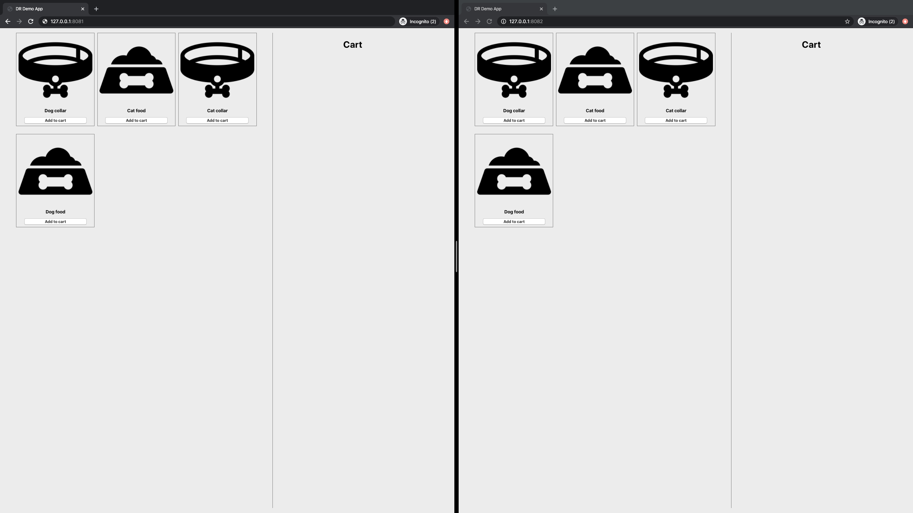
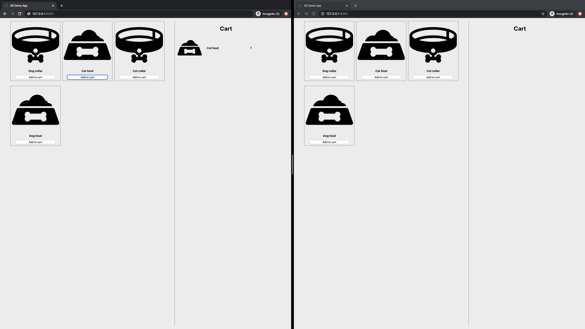
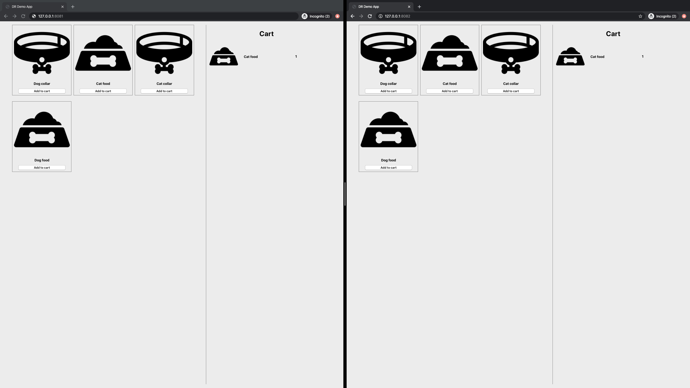

# Clusters Synchronization With GridGain Data Center Replication

The demo shows how to configure Data Center Replication between GridGain clusters. 

In the demo we will fill the shopping cart in one data center, and then make sure that everything is synchronized 
in the second data center.

## Prerequisites

* JDK 1.8 or later: https://www.oracle.com/java/technologies/javase/javase-jdk8-downloads.html.
* Docker (demo was verified on Docker version 19.03.5, build 633a0ea): https://www.docker.com/get-started.

## Build the Demo

Clone or download this repository and build it by running `./gradlew clean assembly` from the root of the project.

## Deploy GridGain Clusters in Docker

* Navigate to `$projectRoot/build/assembly` directory.
* Deploy and start the first cluster: `docker-compose -f config/dc1/dr-compose.yaml up -d`.
* Deploy and start the second cluster: `docker-compose -f config/dc2/dr-compose.yaml up -d`.

## Start Demo Application

Once the clusters are started, you will need to launch two instances of the demo application. Each instance of the application will be connected and working with one of the clusters:
* Start the application for the first cluster - `java -jar -Dserver.port=8081  -Dignite.address=127.0.0.1:10801 dr-demo-app.jar &`
* Start the application for the second cluster - `java -jar -Dserver.port=8082  -Dignite.address=127.0.0.1:10802 dr-demo-app.jar &`

## Verify That Replication Works

You can use `control.sh` script, that is distributed within the GridGain package, to verify that the data center replication is set up and works as expected.

Get access to a docker container of one of the nodes from the first cluster:
`docker-compose -f config/dc1/dr-compose.yaml exec -u 0 data-node /bin/sh` 

After that execute this command: `bin/control.sh --dr state --verbose` 

If you do NOT see this message in this output `Cache cart is stopped with reason "NO_SND_HUBS"`, then replication is set up and works normally. Otherwise, start the replication with this command: `bin/control.sh --dr cache cart --action start --yes`.

## Change Data and See Changes Replicated

Open URLs `http://localhost:8081` and `http://localhost:8082` in your browser. Verify that both carts are 
empty:

 

After that add some items to the cart using the first application (`http://localhost:8081`):

Then switch to application 2 (`http://localhost:8082`), refresh the page and see that the changes were automatically 
replicated to the second cluster:

## Learn More

Lear more about GridGain Data Center replication from our documentation: https://www.gridgain.com/docs/latest/administrators-guide/data-center-replication/configuring-replication
